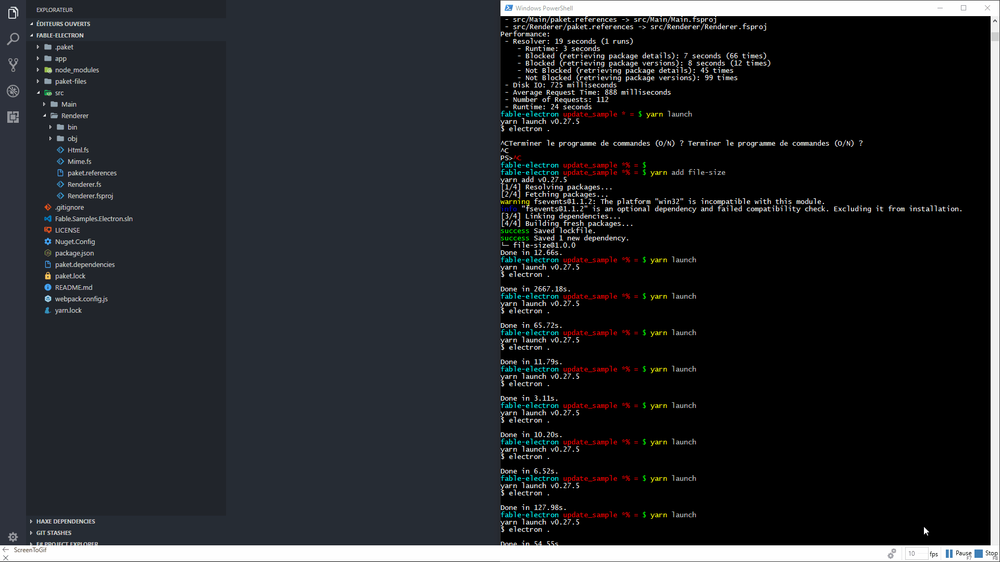

# Fable samples for Github Electron apps

This repository contains samples to show how to create a [Github Electron](https://electron.atom.io/) cross-platform desktop app using F# and [Fable](http://fable.io).

> At the time of writing there's only one simple sample. More to come!

## Requirements

* [dotnet SDK](https://www.microsoft.com/net/download/core) 2.0 or higher
* [node.js](https://nodejs.org) 6.11 or higher
* A JS package manager: [yarn](https://yarnpkg.com) or [npm](http://npmjs.com/)

> npm comes bundled with node.js, but we recommend to use at least npm 5. If you have npm installed, you can upgrade it by running `npm install -g npm`.

Although is not a Fable requirement, on macOS and Linux you'll need [Mono](http://www.mono-project.com/) for other F# tooling like Paket or editor support.

## Editor

The project can be used by editors compatible with the new .fsproj format, like VS Code + [Ionide](http://ionide.io/), Emacs with [fsharp-mode](https://github.com/fsharp/emacs-fsharp-mode) or [Rider](https://www.jetbrains.com/rider/). **Visual Studio for Mac** is also compatible but in the current version the package auto-restore function conflicts with Paket so you need to disable it: `Preferences > Nuget > General`.

## Building and running the app

> In the commands below, yarn is the tool of choice. If you want to use npm, just replace `yarn` by `npm` in the commands.

* Install JS dependencies: `yarn install`
* Install F# dependencies: `dotnet restore`
* Start Fable daemon and [Webpack](https://webpack.js.org/): `yarn start`
* In another terminal, run: `yarn run launch`

> The first two steps are only necessary the first time or whenever the dependencies change.

The app window will be refreshed when you modify any file in the Renderer project. For production, run `yarn run build` to get optimized JS code.

## Releasing the app

> In the commands below, yarn is the tool of choice. If you want to use npm, just replace `yarn` by `npm` in the commands.

* Run `yarn run build`
* Run `yarn run release`
* A `release` folder should be created with a ready to execute application

This will package the electron app for your current platform. This means if you are under `Mac` this will create a `Simple Fable App.app` application that can be executed.

If you want to specify which platform to release, please take a look at [electron-packager](https://github.com/electron-userland/electron-packager). For example, to release to Linux you could do this:

* Add a new `release-linux` script to the package.json file like this:  
    &nbsp;&nbsp;&nbsp;&nbsp;`"release-linux": "electron-packager . --arch=x64 --platform=linux --out release --overwrite"`
* Run `yarn run release-linux`
* Or you could run electron-packager from the command line by first installing npx: `npm install -g npx`
* Try to run npx from your repo folder by typing `npx -v`
* If npx is not found, restart Windows to update the Path environment variable to include ..\AppData\Roaming\npm.
* Run `npx electron-packager . --arch=x64 --platform=linux --out release --overwrite`
* When you try to execute the `Simple Fable App` file on an Ubuntu instance, if it fails to run you might need to `sudo apt-get install libnss3`.

## Architecture

As all Electron apps, the sample is split in two parts:

1. The [main process](https://electron.atom.io/docs/glossary/#main-process), responsible to create the app windows.
2. The [renderer process](https://electron.atom.io/docs/glossary/#renderer-process), responsible to generate the code used by `index.html`.

## Samples

### File explorer

